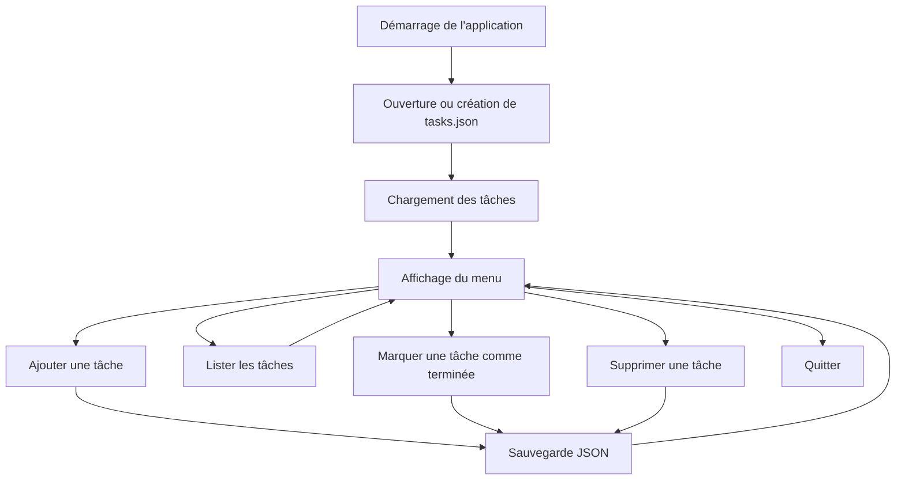
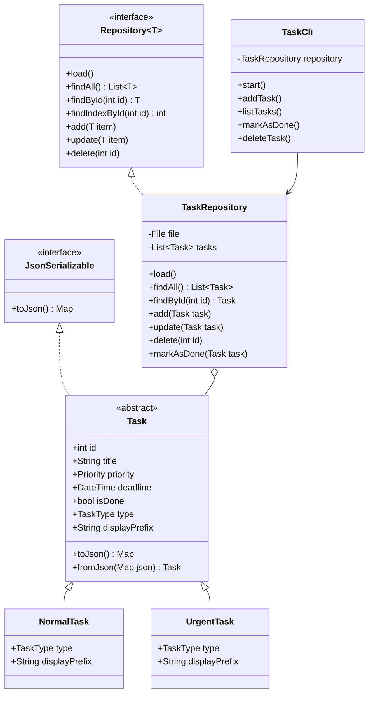

# Dart CLI Task Manager

Application de gestion de tâches en ligne de commande développée entièrement en **Dart**, sans Flutter.

Ce projet permet de créer, consulter, trier, terminer et supprimer des tâches depuis une interface interactive dans le terminal. Les données sont automatiquement conservées dans un fichier JSON local afin de rester disponibles entre deux exécutions.

Le projet met en pratique plusieurs concepts importants de Dart et de la programmation orientée objet :

- classes abstraites ;
- héritage et polymorphisme ;
- interfaces ;
- génériques ;
- enums ;
- exceptions personnalisées ;
- programmation asynchrone ;
- manipulation de fichiers ;
- sérialisation JSON ;
- tests unitaires.

---

## Sommaire

- [Fonctionnalités](#fonctionnalités)
- [Aperçu de l’application](#aperçu-de-lapplication)
- [Prérequis](#prérequis)
- [Installation](#installation)
- [Lancement](#lancement)
- [Utilisation](#utilisation)
- [Persistance des données](#persistance-des-données)
- [Architecture](#architecture)
- [Concepts Dart utilisés](#concepts-dart-utilisés)
- [Gestion des erreurs](#gestion-des-erreurs)
- [Tests](#tests)
- [Qualité du code](#qualité-du-code)
- [Configuration avec Zed](#configuration-avec-zed)
- [Limites actuelles](#limites-actuelles)
- [Améliorations possibles](#améliorations-possibles)
- [Contribution](#contribution)

---

## Fonctionnalités

| Fonctionnalité | Description |
|---|---|
| Ajouter une tâche | Création d’une tâche avec un titre, une priorité, un type et une deadline optionnelle |
| Priorités | Prise en charge des priorités `low`, `medium` et `high` |
| Types de tâches | Prise en charge des tâches normales et urgentes |
| Deadline optionnelle | Saisie d’une date au format ISO, par exemple `2026-08-15` |
| Lister les tâches | Affichage de toutes les tâches enregistrées |
| Trier par priorité | Affichage de la priorité la plus élevée à la plus faible |
| Trier par deadline | Affichage des échéances les plus proches en premier |
| Marquer comme terminée | Modification du statut d’une tâche grâce à son identifiant |
| Supprimer une tâche | Suppression définitive d’une tâche grâce à son identifiant |
| Persistance JSON | Sauvegarde automatique des tâches dans `tasks.json` |
| Identifiants automatiques | Génération d’un identifiant à partir du plus grand ID existant |
| Gestion des erreurs | Utilisation d’exceptions personnalisées |
| Tests unitaires | Tests du repository avec le package `test` |

---

## Aperçu de l’application

L’application propose un menu interactif :

```text
========================
      TASK MANAGER
========================
1. Ajouter une tâche
2. Lister les tâches
3. Marquer comme terminée
4. Supprimer une tâche
5. Quitter

Votre choix :
```

Le fonctionnement général est le suivant :



---

## Prérequis

Pour exécuter le projet, il faut disposer de :

- Dart SDK `3.9.2` ou une version compatible avec la contrainte du projet ;
- Git pour cloner le dépôt ;
- un terminal ;
- un éditeur de code comme Zed, VS Code ou IntelliJ IDEA.

Vérifier l’installation de Dart :

```bash
dart --version
```

Vérifier l’installation de Git :

```bash
git --version
```

Le SDK Dart peut être installé depuis la documentation officielle :

<https://dart.dev/get-dart>

---

## Installation

### 1. Cloner le dépôt

Remplacer `<votre-utilisateur>` par le nom du compte GitHub qui héberge le projet :

```bash
git clone https://github.com/<votre-utilisateur>/dart-cli-manager.git
```

### 2. Entrer dans le projet

```bash
cd dart-cli-manager
```

### 3. Installer les dépendances

```bash
dart pub get
```

### 4. Vérifier le projet

```bash
dart analyze
```

---

## Lancement

Depuis la racine du projet :

```bash
dart run bin/task_manager.dart
```

L’application charge les tâches depuis `tasks.json`, puis affiche le menu interactif.

Si le fichier `tasks.json` n’existe pas, il est automatiquement créé et initialisé avec une liste vide :

```json
[]
```

---

## Utilisation

### Ajouter une tâche

Dans le menu principal, saisir :

```text
1
```

L’application demande ensuite les informations de la tâche.

Exemple :

```text
Titre de la tâche: Terminer le projet Dart
Priorité (low / medium / high) : high
Deadline (optionnel) : 2026-08-15
Type (normal / urgent) : urgent
```

Les champs disponibles sont :

| Champ | Obligatoire | Valeurs ou format |
|---|---:|---|
| Titre | Oui | Texte non vide |
| Priorité | Oui | `low`, `medium` ou `high` |
| Deadline | Non | Date ISO, par exemple `2026-08-15` |
| Type | Oui | `normal` ou `urgent` |

Si aucune deadline n’est nécessaire, il suffit d’appuyer sur Entrée :

```text
Deadline (optionnel) :
```

L’identifiant est généré automatiquement. L’application cherche le plus grand identifiant existant et lui ajoute `1`.

Par exemple, si les IDs existants sont `1`, `2` et `3`, la prochaine tâche recevra l’ID `4`.

---

### Lister les tâches

Dans le menu principal, saisir :

```text
2
```

L’application propose plusieurs méthodes de tri :

```text
Trier les tâches par :
1. Priorité
2. Date
3. Sans tri

Votre choix :
```

#### Tri par priorité

Le tri par priorité utilise l’ordre suivant :

```text
high
medium
low
```

Les tâches les plus importantes sont donc affichées en premier.

#### Tri par deadline

Les deadlines les plus proches sont affichées en premier.

Les tâches sans deadline sont placées après celles qui possèdent une échéance.

#### Sans tri

Les tâches sont affichées dans leur ordre actuel dans le repository.

Exemple d’affichage :

```text
[1] 🔥 | Terminer le projet Dart | HIGH | Deadline: 2026-08-15T00:00:00.000 | À faire
[2]  | Lire la documentation | MEDIUM | Deadline: Pas de deadline | Terminée
```

Le symbole `🔥` permet d’identifier visuellement les tâches urgentes.

---

### Marquer une tâche comme terminée

Dans le menu principal, saisir :

```text
3
```

Puis fournir l’identifiant de la tâche :

```text
ID de la tâche que tu veux marquer comme terminée : 1
```

Si la tâche existe, son champ `isDone` passe de `false` à `true` et le fichier JSON est mis à jour.

Résultat :

```text
Tâche marquée comme terminée.
```

Si l’identifiant n’existe pas :

```text
Tâche non trouvée.
```

---

### Supprimer une tâche

Dans le menu principal, saisir :

```text
4
```

Puis fournir l’identifiant :

```text
Id de la tâche que tu veux supprimer : 2
```

La tâche est supprimée de la collection en mémoire puis le fichier `tasks.json` est mis à jour.

Si aucune tâche ne correspond à l’identifiant, l’application affiche :

```text
Tâche non trouvée.
```

---

### Quitter l’application

Dans le menu principal, saisir :

```text
5
```

L’application termine alors son exécution.

---

## Persistance des données

Les tâches sont enregistrées dans le fichier :

```text
tasks.json
```

Ce fichier est créé dans le répertoire depuis lequel l’application est lancée.

Il est donc recommandé d’exécuter la commande depuis la racine du projet :

```bash
dart run bin/task_manager.dart
```

### Exemple de données JSON

Le contenu est enregistré sous forme de tableau JSON :

```json
[
  {
    "id": 1,
    "title": "Terminer le projet Dart",
    "priority": "high",
    "deadline": "2026-08-15T00:00:00.000",
    "isDone": false,
    "type": "urgent"
  },
  {
    "id": 2,
    "title": "Lire la documentation",
    "priority": "medium",
    "deadline": null,
    "isDone": true,
    "type": "normal"
  }
]
```

Le fichier produit par l’application peut être compacté sur une seule ligne. L’exemple précédent est indenté uniquement pour faciliter sa lecture.

### Description des propriétés

| Propriété | Type | Description |
|---|---|---|
| `id` | `int` | Identifiant unique de la tâche |
| `title` | `String` | Titre de la tâche |
| `priority` | `String` | Priorité : `low`, `medium` ou `high` |
| `deadline` | `String?` | Date ISO 8601 ou `null` |
| `isDone` | `bool` | Indique si la tâche est terminée |
| `type` | `String` | Type : `normal` ou `urgent` |

Lors du démarrage :

1. le repository vérifie si `tasks.json` existe ;
2. s’il n’existe pas, il est créé avec `[]` ;
3. s’il existe, son contenu est décodé ;
4. chaque objet JSON est reconstruit en `NormalTask` ou `UrgentTask` ;
5. les tâches sont conservées en mémoire pendant l’exécution.

Lors d’une modification :

1. la collection en mémoire est mise à jour ;
2. chaque tâche est convertie avec `toJson()` ;
3. la collection est encodée en JSON ;
4. le fichier `tasks.json` est réécrit.

---

## Architecture

### Structure du projet

```text
dart-cli-manager/
├── bin/
│   └── task_manager.dart
├── lib/
│   ├── cli/
│   │   └── task_cli.dart
│   ├── exceptions/
│   │   ├── duplicated_task_exception.dart
│   │   ├── invalid_task_exception.dart
│   │   └── task_not_found_exception.dart
│   ├── interfaces/
│   │   └── json_serializable.dart
│   ├── models/
│   │   ├── normal_task.dart
│   │   ├── task.dart
│   │   └── urgent_task.dart
│   ├── repositories/
│   │   ├── repository.dart
│   │   └── task_repository.dart
│   ├── utils/
│   │   ├── priority.dart
│   │   └── task_type.dart
│   └── task_manager.dart
├── test/
│   └── taski_manager_test.dart
├── analysis_options.yaml
├── pubspec.yaml
└── README.md
```

### Responsabilités principales

| Élément | Responsabilité |
|---|---|
| `bin/task_manager.dart` | Point d’entrée et assemblage des composants |
| `TaskCli` | Interaction avec l’utilisateur via `stdin` et `stdout` |
| `Task` | Modèle abstrait commun à toutes les tâches |
| `NormalTask` | Représentation d’une tâche normale |
| `UrgentTask` | Représentation d’une tâche urgente |
| `JsonSerializable` | Contrat de sérialisation JSON |
| `Repository<T>` | Contrat générique d’accès aux données |
| `TaskRepository` | Chargement, recherche et sauvegarde des tâches |
| `Priority` | Valeurs autorisées pour la priorité |
| `TaskType` | Valeurs autorisées pour le type |
| Exceptions | Représentation des erreurs métier |

### Diagramme de classes



---

## Concepts Dart utilisés

### Classe abstraite

`Task` est une classe abstraite :

```dart
abstract class Task implements JsonSerializable {
  // Propriétés et comportements communs.
}
```

Elle centralise les propriétés communes :

- `id` ;
- `title` ;
- `priority` ;
- `deadline` ;
- `isDone`.

Une `Task` ne doit pas être instanciée directement. L’application utilise un sous-type concret.

---

### Héritage

Les classes `NormalTask` et `UrgentTask` héritent de `Task` :

```dart
class NormalTask extends Task {
  // ...
}
```

```dart
class UrgentTask extends Task {
  // ...
}
```

Chaque sous-type fournit ses propres valeurs pour :

```dart
TaskType get type;
String get displayPrefix;
```

Une tâche urgente affiche notamment le préfixe :

```text
🔥
```

---

### Polymorphisme

Le repository manipule une collection de `Task` :

```dart
final List<Task> _tasks = [];
```

Cette collection peut contenir aussi bien des instances de `NormalTask` que de `UrgentTask`.

Le code peut ainsi manipuler les objets à travers leur type abstrait commun sans connaître systématiquement leur classe concrète.

---

### Interface

L’interface `JsonSerializable` définit le contrat suivant :

```dart
abstract interface class JsonSerializable {
  Map<String, dynamic> toJson();
}
```

`Task` implémente ce contrat et doit donc fournir une méthode `toJson()`.

---

### Génériques

L’interface `Repository<T>` est générique :

```dart
abstract interface class Repository<T> {
  Future<void> load();
  Future<List<T>> findAll();
  Future<T?> findById(int id);
  Future<void> add(T item);
  Future<void> update(T item);
  Future<void> delete(int id);
}
```

Le repository concret spécialise cette interface avec `Task` :

```dart
class TaskRepository implements Repository<Task> {
  // ...
}
```

Cette approche permet de définir un contrat réutilisable pour d’autres types d’entités.

---

### Enums

Les priorités sont représentées par un enum :

```dart
enum Priority {
  low,
  medium,
  high,
}
```

Les types de tâches sont également représentés par un enum :

```dart
enum TaskType {
  normal,
  urgent,
}
```

Les enums évitent les valeurs arbitraires et rendent le domaine plus sûr que l’utilisation de chaînes libres dans le code métier.

---

### Programmation asynchrone

Les opérations de lecture et d’écriture utilisent `Future`, `async` et `await` :

```dart
Future<void> load() async {
  final content = await file.readAsString();
}
```

Cela permet de ne pas bloquer inutilement le programme pendant les opérations d’entrée-sortie.

---

## Gestion des erreurs

Le projet définit plusieurs exceptions personnalisées.

### `DuplicatedTaskException`

Déclenchée lorsqu’une tâche possède un identifiant déjà utilisé :

```dart
throw DuplicatedTaskException('Task already exists');
```

### `InvalidTaskException`

Utilisée lorsqu’une tâche ou le contenu JSON est invalide :

```dart
throw InvalidTaskException('Invalid JSON format');
```

### `TaskNotFoundException`

Déclenchée lorsqu’une opération cible une tâche inexistante :

```dart
throw TaskNotFoundException('Task not found');
```

Ces exceptions permettent de différencier les erreurs techniques et métier au lieu d’utiliser une exception générique pour toutes les situations.

---

## Tests

Les tests utilisent le package officiel `test`.

Installer les dépendances si nécessaire :

```bash
dart pub get
```

Exécuter tous les tests :

```bash
dart test
```

Exécuter uniquement le fichier de tests actuel :

```bash
dart test test/taski_manager_test.dart
```

Afficher davantage de détails :

```bash
dart test --reporter expanded
```

### Scénarios couverts

Le projet contient actuellement six tests :

1. ajout d’une tâche ;
2. refus d’un identifiant déjà utilisé ;
3. recherche d’une tâche par son identifiant ;
4. mise à jour d’une tâche existante ;
5. suppression d’une tâche ;
6. passage d’une tâche à l’état terminé.

### Isolation du système de fichiers

Les tests ne modifient pas le fichier `tasks.json` réel.

Chaque test utilise un répertoire temporaire :

```dart
tempDir = await Directory.systemTemp.createTemp();
file = File('${tempDir.path}/tasks.json');
```

Après le test, le répertoire est supprimé :

```dart
await tempDir.delete(recursive: true);
```

Cette stratégie garantit que les tests sont :

- isolés ;
- reproductibles ;
- indépendants des données de l’utilisateur ;
- sans effet secondaire durable sur le projet.

---

## Qualité du code

### Formater le projet

```bash
dart format .
```

Vérifier le formatage sans modifier les fichiers :

```bash
dart format --output=none --set-exit-if-changed .
```

### Exécuter l’analyse statique

```bash
dart analyze
```

Les règles d’analyse sont configurées dans :

```text
analysis_options.yaml
```

Le projet utilise notamment les lints recommandés :

```yaml
include: package:lints/recommended.yaml
```

### Exécuter les tests

```bash
dart test
```

### Vérification complète avant un commit

```bash
dart format .
dart analyze
dart test
git status
```

Exemple de commit :

```bash
git add .
git commit -m "feat: improve task manager"
git push
```

---

## Dépendances

Les dépendances sont déclarées dans `pubspec.yaml`.

### Dépendances principales

| Package | Rôle |
|---|---|
| `args` | Prévu pour l’analyse d’arguments de ligne de commande |
| `path` | Utilitaire de manipulation de chemins |

L’interface actuelle est interactive et repose directement sur :

```dart
stdin.readLineSync();
stdout.write();
```

Le package `args` pourra être utilisé dans une future version proposant des commandes non interactives comme :

```bash
task-manager add
task-manager list
```

### Dépendances de développement

| Package | Rôle |
|---|---|
| `lints` | Règles d’analyse statique |
| `test` | Écriture et exécution des tests |

---

## Configuration avec Zed

Le projet peut être utilisé avec l’extension Dart de Zed.

Vérifier que Dart est accessible :

```bash
command -v dart
dart --version
```

Exemple de configuration `.zed/settings.json` :

```json
{
  "diagnostics_max_severity": null,
  "diagnostics": {
    "inline": {
      "enabled": true,
      "max_severity": null
    }
  },
  "languages": {
    "Dart": {
      "enable_language_server": true,
      "formatter": "language_server",
      "format_on_save": "on",
      "tab_size": 2
    }
  },
  "lsp": {
    "dart": {
      "settings": {
        "lineLength": 80
      }
    }
  }
}
```

Si Zed ne trouve pas Dart, préciser son chemin absolu :

```json
{
  "lsp": {
    "dart": {
      "binary": {
        "path": "/usr/bin/dart",
        "arguments": [
          "language-server",
          "--protocol=lsp"
        ]
      }
    }
  }
}
```

Adapter `/usr/bin/dart` au résultat de :

```bash
readlink -f "$(command -v dart)"
```

---

## Correspondance avec les objectifs du projet

| Exigence | Implémentation |
|---|---|
| Ajouter une tâche | `TaskCli.addTask()` |
| Titre et priorité | Propriétés de `Task` |
| Deadline optionnelle | `DateTime? deadline` |
| Lister les tâches | `TaskCli.listTasks()` |
| Tri par priorité | Comparaison de `Priority.index` |
| Tri par date | Comparaison de `DateTime` |
| Marquer comme terminée | `TaskRepository.markAsDone()` |
| Supprimer une tâche | `TaskRepository.delete()` |
| Persistance JSON | `TaskRepository.load()` et `_save()` |
| Classe abstraite | `Task` |
| Héritage | `NormalTask` et `UrgentTask` |
| Interface | `JsonSerializable` et `Repository<T>` |
| Génériques | `Repository<T>` |
| Exceptions personnalisées | Trois exceptions métier |
| Au moins cinq tests | Six tests repository |
| Dart pur | Aucune dépendance à Flutter |

---

## Limites actuelles

Le projet est volontairement simple et possède encore quelques limites :

- l’interface est uniquement interactive ;
- les valeurs `normal`, `urgent`, `low`, `medium` et `high` doivent être saisies exactement ;
- le type urgent est choisi manuellement et n’est pas automatiquement lié à la priorité `high` ;
- le stockage utilise un seul fichier JSON local ;
- le fichier JSON n’est pas protégé contre des écritures concurrentes ;
- toutes les tâches sont chargées en mémoire ;
- les identifiants sont des entiers auto-incrémentés localement ;
- les dates ne définissent pas explicitement de fuseau horaire ;
- aucune confirmation n’est demandée avant une suppression ;
- les tests actuels couvrent principalement le repository ;
- l’application ne propose pas encore de commandes avec des options comme `--priority` ou `--deadline`.

---

## Améliorations possibles

Plusieurs évolutions peuvent être envisagées :

- ajouter un `TaskService` entre la CLI et le repository ;
- séparer davantage les règles métier de l’interface utilisateur ;
- ajouter des tests pour la sérialisation JSON ;
- tester le chargement des tâches depuis le fichier ;
- tester les erreurs de JSON invalide ;
- ajouter des tests pour le tri ;
- ajouter des tests pour les tâches urgentes ;
- utiliser le package `args` pour proposer une CLI non interactive ;
- ajouter une commande de modification de tâche ;
- ajouter une confirmation avant suppression ;
- filtrer les tâches terminées et non terminées ;
- rechercher une tâche par titre ;
- générer des identifiants UUID ;
- écrire le JSON de manière atomique avec un fichier temporaire ;
- ajouter une date de création ;
- gérer les deadlines dépassées ;
- afficher les dates dans un format plus lisible ;
- compiler l’application en exécutable natif ;
- ajouter une intégration continue GitHub Actions.

Exemple de compilation native future :

```bash
dart compile exe bin/task_manager.dart -o build/task-manager
```

Puis :

```bash
./build/task-manager
```

---

## Contribution

Les contributions sont les bienvenues.

### Procédure proposée

1. créer un fork du dépôt ;
2. créer une branche :

```bash
git switch -c feature/nom-de-la-fonctionnalite
```

3. effectuer les modifications ;
4. formater et valider le projet :

```bash
dart format .
dart analyze
dart test
```

5. créer un commit :

```bash
git add .
git commit -m "feat: add new feature"
```

6. pousser la branche :

```bash
git push -u origin feature/nom-de-la-fonctionnalite
```

7. ouvrir une Pull Request sur GitHub.

---

## Ressources

- [Documentation officielle Dart](https://dart.dev/)
- [Guide des packages Dart](https://dart.dev/tools/pub/packages)
- [Documentation de `dart:io`](https://api.dart.dev/dart-io/)
- [Documentation de `dart:convert`](https://api.dart.dev/dart-convert/)
- [Package `test`](https://pub.dev/packages/test)
- [Package `lints`](https://pub.dev/packages/lints)
- [Documentation GitHub sur Mermaid](https://docs.github.com/en/get-started/writing-on-github/working-with-advanced-formatting/creating-diagrams)

---

## Auteur

Projet réalisé dans le cadre d’un exercice de maîtrise de Dart et de développement d’une application complète en ligne de commande.
`
