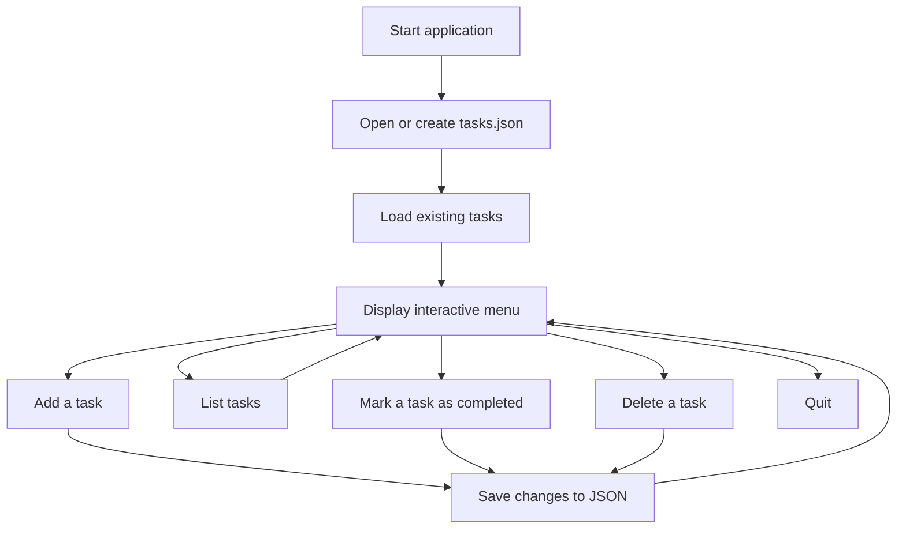
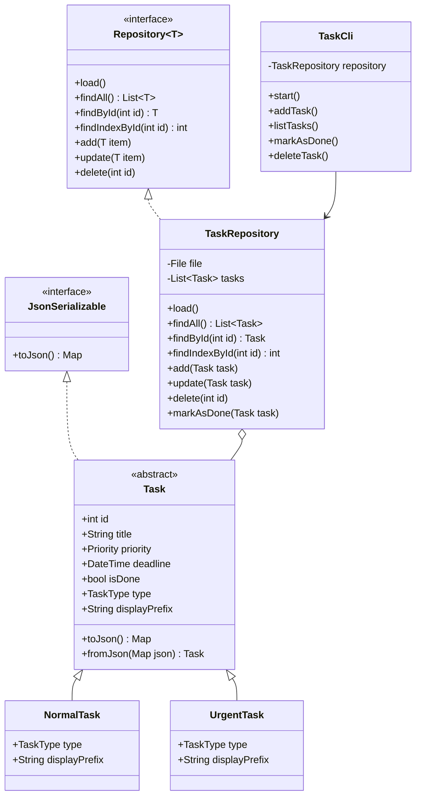
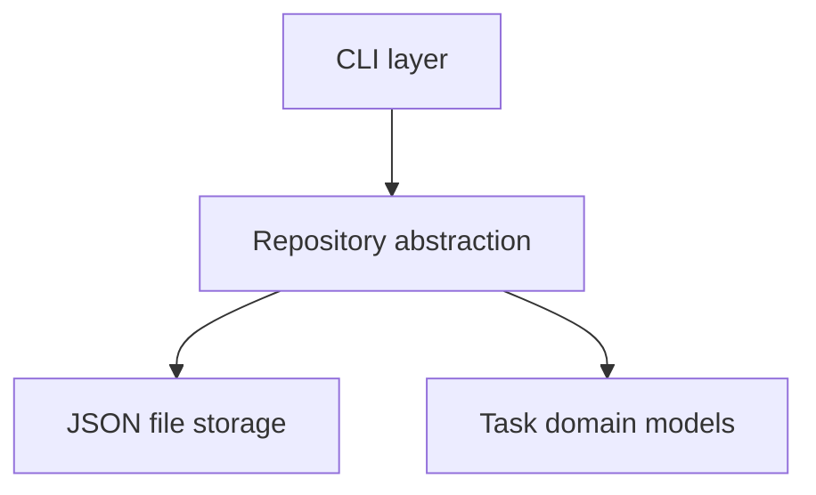

# Dart CLI Task Manager

A complete command-line task management application built with **pure Dart**, without Flutter.

The application provides an interactive terminal interface for creating, listing, sorting, completing, and deleting tasks. Data is automatically persisted in a local JSON file so that tasks remain available between executions.

This project demonstrates several important Dart and object-oriented programming concepts:

- abstract classes;
- inheritance and polymorphism;
- interfaces;
- generics;
- enums;
- custom exceptions;
- asynchronous programming;
- file system operations;
- JSON serialization;
- unit testing.

---

## Table of Contents

- [Features](#features)
- [Application Preview](#application-preview)
- [Requirements](#requirements)
- [Installation](#installation)
- [Running the Application](#running-the-application)
- [Usage](#usage)
- [Data Persistence](#data-persistence)
- [Project Architecture](#project-architecture)
- [Dart Concepts Demonstrated](#dart-concepts-demonstrated)
- [Error Handling](#error-handling)
- [Testing](#testing)
- [Code Quality](#code-quality)
- [Dependencies](#dependencies)
- [Zed Configuration](#zed-configuration)
- [Project Requirements Coverage](#project-requirements-coverage)
- [Current Limitations](#current-limitations)
- [Possible Improvements](#possible-improvements)
- [Contributing](#contributing)
- [Resources](#resources)

---

## Features

| Feature | Description |
|---|---|
| Add a task | Create a task with a title, priority, type, and optional deadline |
| Task priorities | Supports `low`, `medium`, and `high` priorities |
| Task types | Supports normal and urgent tasks |
| Optional deadline | Accepts ISO-formatted dates such as `2026-08-15` |
| List tasks | Displays all tasks currently stored |
| Sort by priority | Displays high-priority tasks first |
| Sort by deadline | Displays the closest deadlines first |
| Mark as completed | Changes a task's completion status using its ID |
| Delete a task | Permanently removes a task using its ID |
| JSON persistence | Automatically saves tasks to `tasks.json` |
| Automatic IDs | Generates the next ID from the highest existing ID |
| Custom exceptions | Uses domain-specific exceptions for expected failures |
| Unit tests | Tests repository behavior using the `test` package |

---

## Application Preview

The application provides the following interactive menu:

```text
========================
      TASK MANAGER
========================
1. Add a task
2. List tasks
3. Mark a task as completed
4. Delete a task
5. Quit

Your choice:
```

The general application flow is:



---

## Requirements

Before running the project, make sure the following tools are installed:

- Dart SDK `3.9.2` or a version compatible with the SDK constraint;
- Git;
- a terminal;
- an editor such as Zed, Visual Studio Code, or IntelliJ IDEA.

Check your Dart installation:

```bash
dart --version
```

Check your Git installation:

```bash
git --version
```

If Dart is not installed, follow the official installation guide:

<https://dart.dev/get-dart>

---

## Installation

### 1. Clone the repository

Replace `<your-github-username>` with the GitHub username hosting the repository:

```bash
git clone https://github.com/<your-github-username>/dart-cli-manager.git
```

### 2. Enter the project directory

```bash
cd dart-cli-manager
```

### 3. Install dependencies

```bash
dart pub get
```

### 4. Analyze the project

```bash
dart analyze
```

---

## Running the Application

Run the application from the project root:

```bash
dart run bin/task_manager.dart
```

At startup, the application loads existing tasks from `tasks.json` and displays the interactive menu.

If `tasks.json` does not exist, it is automatically created and initialized with an empty JSON array:

```json
[]
```

---

## Usage

### Adding a Task

Select the following option from the main menu:

```text
1
```

The application then asks for the task details.

Example:

```text
Task title: Complete the Dart project
Priority (low / medium / high): high
Deadline (optional): 2026-08-15
Type (normal / urgent): urgent
```

The available fields are:

| Field | Required | Accepted value |
|---|---:|---|
| Title | Yes | Any non-empty text |
| Priority | Yes | `low`, `medium`, or `high` |
| Deadline | No | ISO date such as `2026-08-15` |
| Type | Yes | `normal` or `urgent` |

To create a task without a deadline, press Enter without entering a value:

```text
Deadline (optional):
```

Task IDs are generated automatically. The application finds the highest existing ID and adds `1`.

For example, if the existing IDs are `1`, `2`, and `3`, the next task receives ID `4`.

---

### Listing Tasks

Select:

```text
2
```

The application asks how the tasks should be sorted:

```text
Sort tasks by:
1. Priority
2. Date
3. No sorting

Your choice:
```

#### Sort by priority

Priority sorting uses the following order:

```text
high
medium
low
```

The most important tasks are therefore displayed first.

#### Sort by deadline

Tasks with the closest deadlines are displayed first.

Tasks without a deadline are placed after tasks that have one.

#### No sorting

Tasks are displayed in their current repository order.

Example output:

```text
[1] 🔥 | Complete the Dart project | HIGH | Deadline: 2026-08-15T00:00:00.000 | To do
[2]  | Read the Dart documentation | MEDIUM | Deadline: No deadline | Completed
```

Urgent tasks use the `🔥` prefix to make them easier to identify.

> The application's current terminal messages are written in French. The examples in this README are translated to explain their meaning.

---

### Marking a Task as Completed

Select:

```text
3
```

Enter the ID of the task:

```text
ID of the task to mark as completed: 1
```

If the task exists, its `isDone` property changes from `false` to `true`, and the JSON file is updated.

If no task matches the ID, the application displays a task-not-found message.

---

### Deleting a Task

Select:

```text
4
```

Enter the ID of the task to delete:

```text
ID of the task to delete: 2
```

The task is removed from the in-memory collection, and `tasks.json` is updated.

If the ID does not exist, the application displays a task-not-found message.

---

### Quitting the Application

Select:

```text
5
```

The program then ends its execution.

---

## Data Persistence

Tasks are stored in:

```text
tasks.json
```

The file is created in the directory from which the application is launched.

For predictable behavior, run the application from the project root:

```bash
dart run bin/task_manager.dart
```

### JSON Example

Tasks are persisted as a JSON array:

```json
[
  {
    "id": 1,
    "title": "Complete the Dart project",
    "priority": "high",
    "deadline": "2026-08-15T00:00:00.000",
    "isDone": false,
    "type": "urgent"
  },
  {
    "id": 2,
    "title": "Read the Dart documentation",
    "priority": "medium",
    "deadline": null,
    "isDone": true,
    "type": "normal"
  }
]
```

The file generated by the application may be stored on a single line. The previous example is formatted only to make it easier to read.

### JSON Properties

| Property | Type | Description |
|---|---|---|
| `id` | `int` | Unique task identifier |
| `title` | `String` | Task title |
| `priority` | `String` | `low`, `medium`, or `high` |
| `deadline` | `String?` | ISO 8601 date or `null` |
| `isDone` | `bool` | Indicates whether the task is completed |
| `type` | `String` | `normal` or `urgent` |

### Loading Process

When the application starts:

1. the repository checks whether `tasks.json` exists;
2. if it does not exist, the file is created with `[]`;
3. if it exists, its content is decoded;
4. every JSON object is converted into a `NormalTask` or `UrgentTask`;
5. the tasks are kept in memory while the application is running.

### Saving Process

When a task is added, updated, completed, or deleted:

1. the in-memory collection is updated;
2. each task is converted using `toJson()`;
3. the collection is encoded as JSON;
4. `tasks.json` is rewritten with the latest data.

---

## Project Architecture

### Directory Structure

```text
dart-cli-manager/
├── bin/
│   └── task_manager.dart
├── lib/
│   ├── cli/
│   │   └── task_cli.dart
│   ├── exceptions/
│   │   ├── duplicated_task_exception.dart
│   │   ├── invalid_task_exception.dart
│   │   └── task_not_found_exception.dart
│   ├── interfaces/
│   │   └── json_serializable.dart
│   ├── models/
│   │   ├── normal_task.dart
│   │   ├── task.dart
│   │   └── urgent_task.dart
│   ├── repositories/
│   │   ├── repository.dart
│   │   └── task_repository.dart
│   ├── utils/
│   │   ├── priority.dart
│   │   └── task_type.dart
│   └── task_manager.dart
├── test/
│   └── taski_manager_test.dart
├── analysis_options.yaml
├── pubspec.yaml
└── README.md
```

### Main Responsibilities

| Component | Responsibility |
|---|---|
| `bin/task_manager.dart` | Application entry point and dependency creation |
| `TaskCli` | User interaction through `stdin` and `stdout` |
| `Task` | Abstract model containing common task properties |
| `NormalTask` | Concrete representation of a normal task |
| `UrgentTask` | Concrete representation of an urgent task |
| `JsonSerializable` | JSON serialization contract |
| `Repository<T>` | Generic data-access contract |
| `TaskRepository` | Task loading, searching, updating, and persistence |
| `Priority` | Allowed priority values |
| `TaskType` | Allowed task type values |
| Custom exceptions | Domain-specific failure representation |

### Class Diagram



### Separation of Responsibilities

The project separates its main concerns into different layers:



- The CLI handles terminal input and output.
- The models represent the task domain.
- The repository manages data access and persistence.
- Interfaces define contracts between components.
- Exceptions represent expected domain failures.

This separation makes the code easier to understand, test, and extend.

---

## Dart Concepts Demonstrated

### Abstract Classes

`Task` is an abstract class:

```dart
abstract class Task implements JsonSerializable {
  // Shared task properties and behavior.
}
```

It contains the properties shared by every task:

- `id`;
- `title`;
- `priority`;
- `deadline`;
- `isDone`.

A `Task` cannot be instantiated directly. The application uses one of its concrete subclasses.

---

### Inheritance

`NormalTask` and `UrgentTask` inherit from `Task`:

```dart
class NormalTask extends Task {
  // ...
}
```

```dart
class UrgentTask extends Task {
  // ...
}
```

Each subclass provides its own implementation of:

```dart
TaskType get type;
String get displayPrefix;
```

Urgent tasks use the following display prefix:

```text
🔥
```

---

### Polymorphism

The repository stores a collection of the abstract `Task` type:

```dart
final List<Task> _tasks = [];
```

The same collection can contain both `NormalTask` and `UrgentTask` instances.

This allows the repository to manipulate tasks through their common abstract type without depending on every concrete subclass.

---

### Interfaces

The `JsonSerializable` interface defines a serialization contract:

```dart
abstract interface class JsonSerializable {
  Map<String, dynamic> toJson();
}
```

Because `Task` implements this interface, it must provide a `toJson()` method.

---

### Generics

The repository interface uses a generic type parameter:

```dart
abstract interface class Repository<T> {
  Future<void> load();
  Future<List<T>> findAll();
  Future<T?> findById(int id);
  Future<void> add(T item);
  Future<void> update(T item);
  Future<void> delete(int id);
}
```

The concrete repository specializes the interface for tasks:

```dart
class TaskRepository implements Repository<Task> {
  // ...
}
```

This generic contract could later be reused for other entity types.

---

### Enums

Task priorities use an enum:

```dart
enum Priority {
  low,
  medium,
  high,
}
```

Task types also use an enum:

```dart
enum TaskType {
  normal,
  urgent,
}
```

Enums prevent unsupported values from being used inside the domain model.

---

### Asynchronous Programming

File operations use `Future`, `async`, and `await`:

```dart
Future<void> load() async {
  final content = await file.readAsString();
}
```

This provides a clean asynchronous API for reading and writing data.

---

### JSON Serialization

Tasks implement `toJson()` to convert themselves into JSON-compatible maps:

```dart
Map<String, dynamic> toJson() {
  return {
    'id': id,
    'title': title,
    'priority': priority.name,
    'deadline': deadline?.toIso8601String(),
    'isDone': isDone,
    'type': type.name,
  };
}
```

The `Task.fromJson()` factory reconstructs the appropriate subclass based on the stored `type`.

---

## Error Handling

The project defines several custom exceptions.

### `DuplicatedTaskException`

Thrown when a task uses an ID that already exists:

```dart
throw DuplicatedTaskException('Task already exists');
```

### `InvalidTaskException`

Used when a task or JSON data is invalid:

```dart
throw InvalidTaskException('Invalid JSON format');
```

### `TaskNotFoundException`

Thrown when an operation targets a task that does not exist:

```dart
throw TaskNotFoundException('Task not found');
```

Custom exceptions make failures more explicit and prevent every error from being represented by a generic exception.

---

## Testing

The test suite uses the official Dart `test` package.

### Run all tests

```bash
dart test
```

### Run the current test file

```bash
dart test test/taski_manager_test.dart
```

### Use the expanded reporter

```bash
dart test --reporter expanded
```

### Current Test Cases

The project currently contains six tests:

1. adding a task;
2. rejecting a duplicated task ID;
3. finding a task by ID;
4. updating an existing task;
5. deleting an existing task;
6. marking a task as completed.

### File System Isolation

Tests do not modify the application's real `tasks.json` file.

A temporary directory is created during each test:

```dart
tempDir = await Directory.systemTemp.createTemp();
file = File('${tempDir.path}/tasks.json');
```

The directory is removed after the test:

```dart
await tempDir.delete(recursive: true);
```

This strategy makes the tests:

- isolated;
- reproducible;
- independent from user data;
- free from persistent file-system side effects.

---

## Code Quality

### Format the project

```bash
dart format .
```

### Verify formatting without modifying files

```bash
dart format --output=none --set-exit-if-changed .
```

### Run static analysis

```bash
dart analyze
```

The analysis rules are configured in:

```text
analysis_options.yaml
```

The project uses Dart's recommended lints:

```yaml
include: package:lints/recommended.yaml
```

### Run the tests

```bash
dart test
```

### Recommended check before committing

```bash
dart format .
dart analyze
dart test
git status
```

Example commit:

```bash
git add .
git commit -m "feat: improve task manager"
git push
```

---

## Dependencies

Dependencies are declared in `pubspec.yaml`.

### Runtime Dependencies

| Package | Purpose |
|---|---|
| `args` | Available for a future argument-based CLI |
| `path` | Utilities for working with file-system paths |

The current CLI is interactive and directly uses:

```dart
stdin.readLineSync();
stdout.write();
```

The `args` package may later be used to provide non-interactive commands such as:

```bash
task-manager add
task-manager list
```

### Development Dependencies

| Package | Purpose |
|---|---|
| `lints` | Static analysis rules |
| `test` | Unit test creation and execution |

---

## Zed Configuration

The project can be developed using Zed's Dart extension.

Verify that Dart is available:

```bash
command -v dart
dart --version
```

Example `.zed/settings.json` configuration:

```json
{
  "diagnostics_max_severity": null,
  "diagnostics": {
    "inline": {
      "enabled": true,
      "max_severity": null
    }
  },
  "languages": {
    "Dart": {
      "enable_language_server": true,
      "formatter": "language_server",
      "format_on_save": "on",
      "tab_size": 2
    }
  },
  "lsp": {
    "dart": {
      "settings": {
        "lineLength": 80
      }
    }
  }
}
```

If Zed cannot find Dart, configure the absolute SDK path:

```json
{
  "lsp": {
    "dart": {
      "binary": {
        "path": "/usr/bin/dart",
        "arguments": [
          "language-server",
          "--protocol=lsp"
        ]
      }
    }
  }
}
```

Replace `/usr/bin/dart` with the result of:

```bash
readlink -f "$(command -v dart)"
```

---

## Project Requirements Coverage

| Requirement | Implementation |
|---|---|
| Add a task | `TaskCli.addTask()` |
| Title and priority | Properties of `Task` |
| Optional deadline | `DateTime? deadline` |
| List tasks | `TaskCli.listTasks()` |
| Sort by priority | Comparison using `Priority.index` |
| Sort by date | Comparison using `DateTime` |
| Mark as completed | `TaskRepository.markAsDone()` |
| Delete a task | `TaskRepository.delete()` |
| JSON persistence | `TaskRepository.load()` and `_save()` |
| Abstract class | `Task` |
| Inheritance | `NormalTask` and `UrgentTask` |
| Interface | `JsonSerializable` and `Repository<T>` |
| Generics | `Repository<T>` |
| Custom exceptions | Three domain-specific exceptions |
| At least five tests | Six repository tests |
| Pure Dart | No Flutter dependency |

---

## Current Limitations

The project is intentionally simple and currently has the following limitations:

- the interface is interactive only;
- values such as `low`, `medium`, `high`, `normal`, and `urgent` must be entered exactly;
- urgent tasks are selected manually and are not automatically linked to the `high` priority;
- all tasks are stored in a single local JSON file;
- concurrent file writes are not handled;
- all tasks are loaded into memory;
- IDs are local auto-incrementing integers;
- deadlines do not explicitly include time-zone handling;
- task deletion does not require confirmation;
- current tests mainly cover the repository;
- argument-based commands such as `--priority` and `--deadline` are not implemented yet.

---

## Possible Improvements

Potential future improvements include:

- adding a `TaskService` between the CLI and repository;
- moving business rules out of the terminal interface;
- adding JSON serialization tests;
- testing task loading from disk;
- testing invalid JSON handling;
- adding sorting tests;
- adding urgent task tests;
- using the `args` package for a non-interactive CLI;
- adding a task editing command;
- asking for confirmation before deletion;
- filtering completed and uncompleted tasks;
- searching tasks by title;
- generating UUID identifiers;
- writing JSON atomically through a temporary file;
- adding task creation dates;
- detecting overdue deadlines;
- improving date formatting;
- compiling the application into a native executable;
- adding GitHub Actions continuous integration.

### Native compilation

The application can eventually be compiled into a native executable:

```bash
dart compile exe bin/task_manager.dart -o build/task-manager
```

Run the generated executable with:

```bash
./build/task-manager
```

---

## Contributing

Contributions are welcome.

### Suggested Workflow

1. Fork the repository.
2. Create a feature branch:

```bash
git switch -c feature/feature-name
```

3. Implement the change.
4. Format, analyze, and test the project:

```bash
dart format .
dart analyze
dart test
```

5. Create a commit:

```bash
git add .
git commit -m "feat: add new feature"
```

6. Push the branch:

```bash
git push -u origin feature/feature-name
```

7. Open a Pull Request on GitHub.

---

## Resources

- [Official Dart documentation](https://dart.dev/)
- [Dart package documentation](https://dart.dev/tools/pub/packages)
- [`dart:io` documentation](https://api.dart.dev/dart-io/)
- [`dart:convert` documentation](https://api.dart.dev/dart-convert/)
- [`test` package](https://pub.dev/packages/test)
- [`lints` package](https://pub.dev/packages/lints)
- [GitHub Mermaid documentation](https://docs.github.com/en/get-started/writing-on-github/working-with-advanced-formatting/creating-diagrams)

---

## Author

This project was created as a practical exercise to demonstrate Dart proficiency by building a complete command-line application.
`
